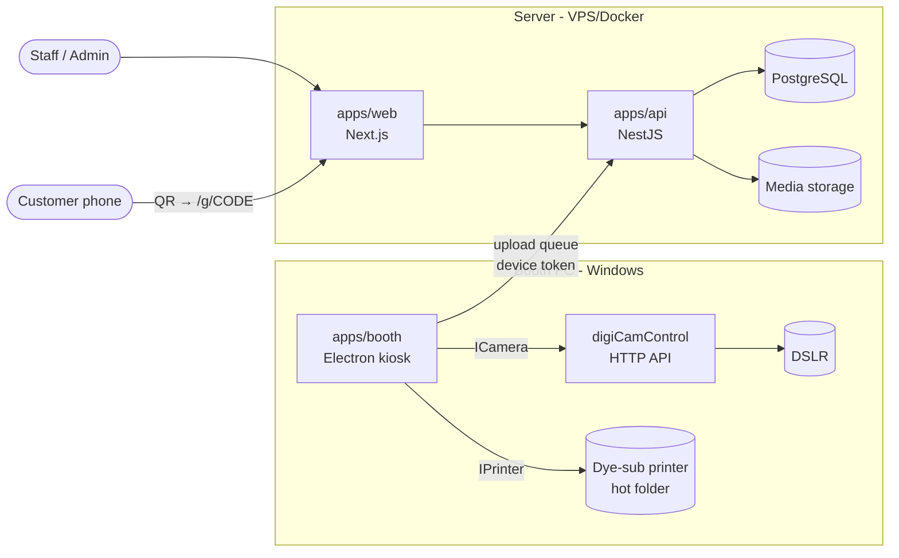

# PhotoMob → Potoku (Planning Docs)

Self photo booth system, end to end: booking at the store → DSLR-powered self-service capture → on-site printing → digital delivery through expiring gallery links.

> **Status: This repo is planning documentation only** ([ADR-016](docs/DECISIONS.md)). Code lives in three repos under the product codename **Potoku**:
>
> | Repo | What | Stack |
> |---|---|---|
> | [potoku](https://github.com/tokudev-id/potoku) | Booth app | Electron + React + `@potoku/template-kit` |
> | [potoku-api](https://github.com/tokudev-id/potoku-api) | Backend | .NET 8 · Clean Architecture + DDD · EF Core/PostgreSQL · Redis · Docker |
> | [potoku-platform-web](https://github.com/tokudev-id/potoku-platform-web) | Admin + SaaS platform + public gallery | React + Vite |
>
> Start with [docs/PRD.md](docs/PRD.md).

---

## What Is This?

PhotoMob is a **template-driven, whitelabel** photo booth platform for a physical store. Frames, layouts, and styles are data + assets managed from the admin panel — never code — so new looks ship without redeploying the booth. The brand itself (name, logo, colors, copy, domain) is config too: the same codebase ships as a single-brand install for a client or grows into a multi-brand SaaS ([ADR-012](docs/DECISIONS.md)).

Three deployable apps, one TypeScript monorepo:

| App | Runs on | For | Does |
|---|---|---|---|
| `apps/booth` | Booth PC (Electron, Windows kiosk) | Customers | Self-service session: template → DSLR capture → select → print → QR |
| `apps/web` | Server (Next.js) | Staff/Admin + Customers | Bookings, payments, templates, sessions **and** the public expiring gallery |
| `apps/api` | Server (NestJS) | Everything | Owns bookings, sessions, media, templates, delivery links |

### Architecture at a glance

### Tech Stack

- **Language**: TypeScript everywhere (pnpm workspaces monorepo)
- **API**: NestJS + PostgreSQL + Prisma
- **Web**: Next.js (App Router) — admin/staff area + public gallery
- **Booth**: Electron + React (Vite), `sharp` for composition, SQLite upload queue
- **DSLR**: digiCamControl HTTP bridge behind an `ICamera` interface (webcam fallback)
- **Printing**: hot-folder pipeline behind an `IPrinter` interface

---

## Documents

| Document | Answers |
|---|---|
| [docs/PRD.md](docs/PRD.md) | What are we building, for whom, which flows, in what order |
| [docs/ARCHITECTURE.md](docs/ARCHITECTURE.md) | How the system is designed inside |
| [docs/DECISIONS.md](docs/DECISIONS.md) | Why it is built this way (ADRs), trade-offs accepted |
| [docs/tasks/](docs/tasks/README.md) | Who builds what: per-program task breakdown (specs, tests, edge cases) for M0–M4 |

---

## Reference Project

The `boothlev` project was reviewed as **UX reference only** (template/editor concepts). PhotoMob's flow, theme, and architecture are intentionally different — boothlev is a client-side webcam toy with no DSLR, booking, printing, or delivery. Its observed weaknesses (god-file editor, hardcoded template catalog, localStorage image blobs, docs drifting from code) are explicitly designed against here — see [docs/DECISIONS.md](docs/DECISIONS.md).
