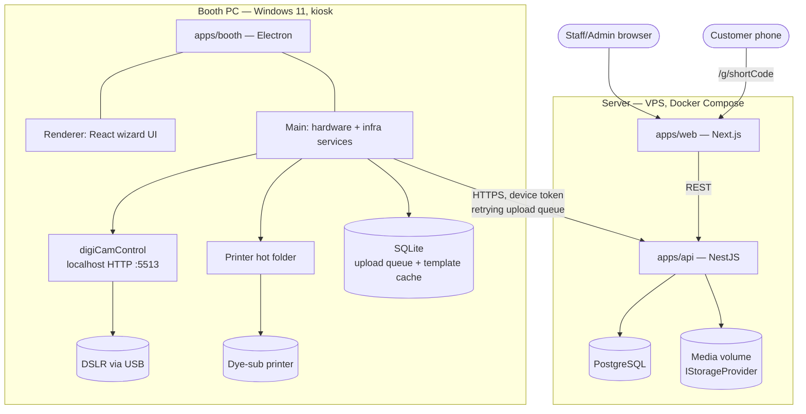
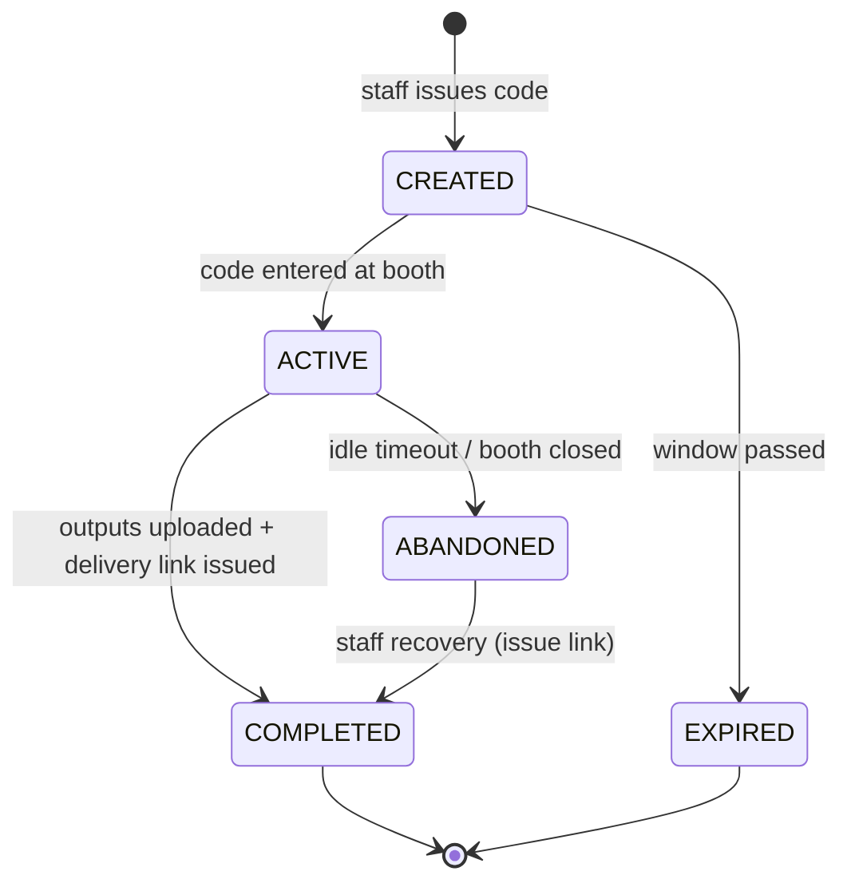
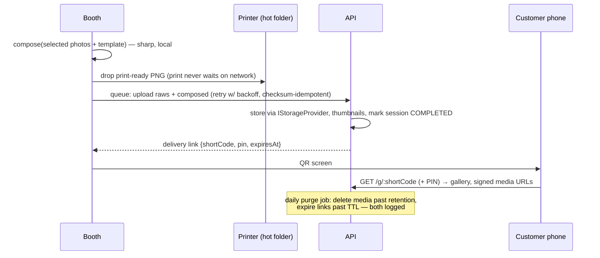
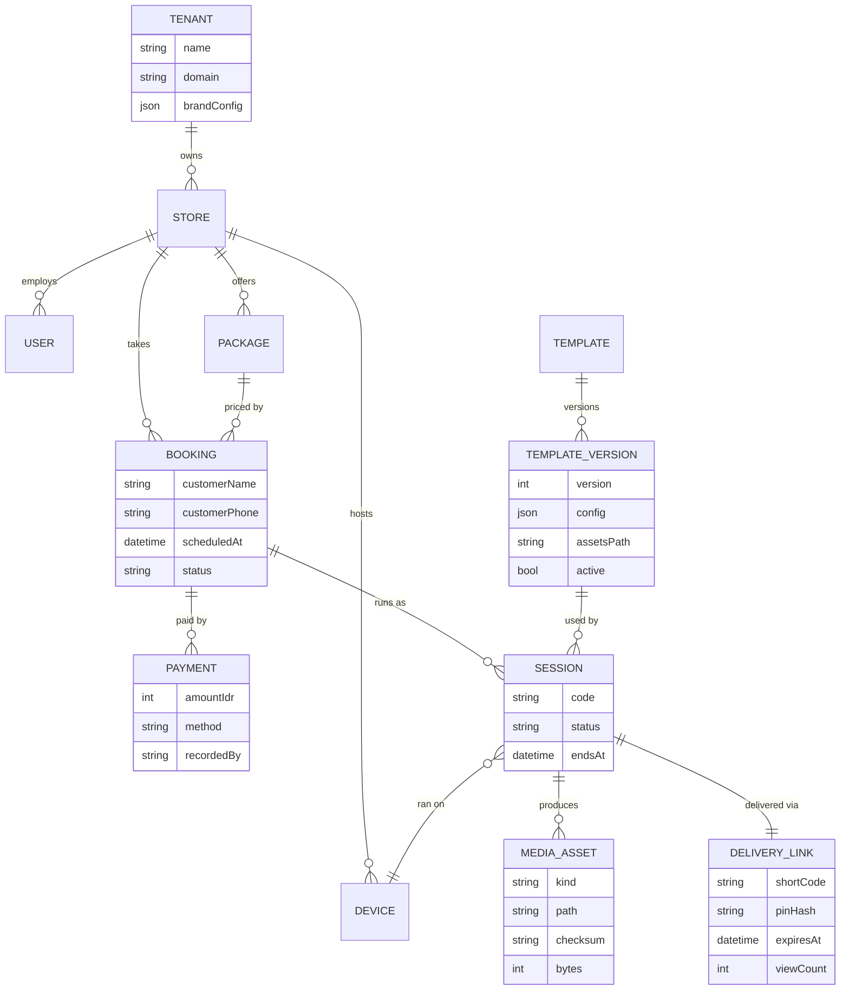

# PhotoMob — Architecture

> ⚠️ **Partially superseded by [ADR-016](DECISIONS.md)** (2026-07-11): backend is now **.NET 8 Clean Architecture** in [potoku-api](https://github.com/tokudev-id/potoku-api) (not NestJS), the monorepo is split into three repos, and the web platform is React + Vite. The *domain design* below — module boundaries, state machines, media pipeline, template system, ERD, security zones — still holds and maps 1:1 onto the .NET layers. Sections 2–3 read as the NestJS-era shape; treat potoku-api's README as current for backend structure.

> How the system is designed inside. Product context in [PRD.md](PRD.md); the *why* behind each choice in [DECISIONS.md](DECISIONS.md).

Design stance (from the Adaptive Domain Separation pattern): **know the ideal, apply only the separation today's complexity justifies, and keep the evolution path explicit.** SOLID shows up as interfaces at the *volatile edges* (camera, printer, storage, delivery) — not as ceremony in stable CRUD.

---

## 1. System Overview



Three trust zones, three auth mechanisms (§10): staff JWT, booth device token, customer short-code+PIN.

---

## 2. Monorepo Layout

pnpm workspaces. No Nx/Turbo until build times hurt (they won't at 3 apps).

```
photomob/
├── apps/
│   ├── api/            # NestJS — the domain owner
│   ├── web/            # Next.js — admin/staff area + public gallery (route groups)
│   └── booth/          # Electron + React (Vite)
├── packages/
│   └── shared/         # DTO contracts, template schema + validators, enums, session codes
├── docs/
└── package.json        # workspace root
```

Rules:
- `packages/shared` is the single source of truth for API contracts and the template JSON schema (zod). Apps import it; it imports nothing from apps.
- No `packages/ui` in v1 — booth and web have different design constraints; sharing components now is premature abstraction.

---

## 3. Backend (`apps/api`) — NestJS

Modules sized by the adaptive scale: simple CRUD stays Level 1 (controller → service → repository), business logic gets Level 2 (explicit domain rules). No core/domain module splits in v1 — no module has multiple consumers with divergent logic yet. The split path is documented in §12.

| Module | Level | Owns | Notable rules |
|---|---|---|---|
| `auth` | 1 | Staff login (JWT), guards: `StaffGuard`, `DeviceGuard`, public rate-limited gallery routes | |
| `users` | 1 | Staff/admin accounts, roles (ADMIN, STAFF) | |
| `catalog` | 1 | Packages (price, session duration, shooting window + shot cap, allowed template categories, link TTL) | |
| `branding` | 1 | Tenant + brand config (theme tokens, logo, name, copy, domain); public brand-manifest endpoint | Standalone deployments have exactly one tenant row (ADR-012) |
| `bookings` | 2 | Bookings + payment records (sub-resource) | Status transitions; check-in requires completed payment (override logged) |
| `sessions` | 2 | Session lifecycle, code issue/validate, session events | State machine (§6); codes single-use, time-window bound |
| `templates` | 2 | Template configs + assets, versioning, activation | Versions immutable once a session references them |
| `media` | 2 | Ingest uploads, `IStorageProvider`, thumbnails, **retention purge job** | Idempotent upload (checksum); purge only past retention + logged |
| `delivery` | 2 | Delivery links, expiry, public gallery endpoints | Short-code entropy, PIN check, signed media URLs, rate limiting |
| `devices` | 1 | Booth registration, heartbeat, health + hardware-config snapshot (ADR-015) | |

Dependency rule (enforced with ESLint `no-restricted-imports`): modules depend on other modules **only via their exported service interfaces**, dependencies flow toward data owners (e.g. `delivery` → `sessions` → `bookings`), never in reverse, no cross-imports between sibling leaf modules.

Per-layer DTOs only where a layer boundary actually exists (controller DTOs ≠ persistence models, always). Internal orchestrator/domain DTO ceremony is skipped until a module earns Level 3.

**Database**: PostgreSQL + Prisma. Money as integer (IDR has no cents). All domain tables carry `storeId` from day one — multi-store later is a UI problem, not a migration problem.

**Tenancy** (ADR-012): `TENANT` sits above `STORE`; every store belongs to a tenant, and brand config lives on the tenant. A standalone single-brand install is the same artifact running with **one tenant row** — SaaS mode is "more rows + domain-based tenant resolution", not different code. No tenant logic beyond tenant scoping exists in v1 (no signup, billing, or plan limits).

---

## 4. Booth App (`apps/booth`) — Electron

The most failure-prone environment in the system (USB cameras, printers, flaky Wi-Fi, customers), so it gets the most deliberate structure.

```
apps/booth/src/
├── main/                        # Electron main — everything that touches hardware/OS
│   ├── camera/
│   │   ├── camera.interface.ts      # ICamera
│   │   ├── digicamcontrol.camera.ts # DSLR via dCC HTTP API
│   │   ├── webcam.camera.ts         # fallback (renderer getUserMedia, brokered via IPC)
│   │   └── camera.supervisor.ts     # health checks, failover DSLR → webcam
│   ├── printer/
│   │   ├── printer.interface.ts     # IPrinter
│   │   ├── hotfolder.printer.ts     # DNP (official Hot Folder Print utility)
│   │   └── spooler.printer.ts       # HiTi + plain printers (driver via Windows spooler)
│   ├── composer/                    # sharp pipeline: photos + template → print-ready PNG
│   ├── settings/                    # booth-local hardware config: zod-validated JSON store, device enumeration, hardware check (ADR-015)
│   ├── sync/                        # upload queue (SQLite, retry/backoff), template cache
│   ├── session/                     # local session runtime, event log, crash recovery
│   └── ipc/                         # typed IPC contract (types in packages/shared)
└── renderer/                    # React wizard — screens 1–10 of PRD F2
    ├── screens/                     # attract, code-entry, template, capture, select, ... + settings (PIN-gated, hidden gesture)
    ├── machine/                     # wizard step state (typed reducer; XState only if it earns it)
    └── theme/                       # tokens hydrated from the brand manifest (ADR-012), cached for offline
```

Principles:
- **Renderer never touches hardware.** Every capture/print/upload crosses the typed IPC boundary. The wizard is a pure UI state machine — trivially testable, and boothlev's god-file problem is structurally impossible.
- **`ICamera` is the whole DSLR story**: `initialize()`, `startLiveView(): AsyncIterable<Frame>`, `capture(): Promise<CapturedPhoto>`, `getHealth()`, `dispose()`. digiCamControl, webcam, and a `MockCamera` (dev/CI) implement it. OCP: adding Canon EDSDK later is a new adapter, zero flow changes.
- **Crash recovery**: session runtime journals every step + captured file locally; on relaunch, an interrupted session resumes at Select with its photos intact.
- **Kiosk**: fullscreen kiosk mode, auto-launch on boot, watchdog relaunch, Windows shell lockdown per deployment checklist (§11).
- **Hardware config is booth-local; business config is server-owned** (ADR-015). The settings screen enumerates cameras (dCC list + `enumerateDevices()`) and printers (`getPrintersAsync()` / hot-folder picker), persists to a local zod-validated JSON file, and offers Test capture / Test print. Selection just parameterizes adapter construction. Heartbeat carries a config snapshot for the admin dashboard; changes are logged as device events; settings lock while a session is ACTIVE.

---

## 5. DSLR Integration — digiCamControl Bridge

digiCamControl runs as a companion app on the booth PC with its built-in webserver enabled (`localhost:5513`). The adapter uses:

| Need | dCC endpoint / mechanism |
|---|---|
| Capture | `/?slc=capture` (single command URL); file lands in a configured session folder; adapter watches the folder + polls `list camera1.lastcaptured` to resolve the exact file |
| Live view | `/liveview.jpg` — MJPEG-style polling at ~15fps into the renderer via IPC stream |
| Settings | `set` commands (ISO, aperture, shutter) — applied once at session start from per-store camera profile |
| Health | Periodic `list cameras`; empty list → camera disconnected |

Failure policy (`camera.supervisor.ts`):
1. Capture timeout (>4s) → one retry.
2. Second failure or disconnect → mark DSLR unhealthy → **failover to `WebcamCamera`** mid-session, banner "camera assist mode", staff alert via device heartbeat.
3. Background reconnect probe; DSLR restored on next session, never mid-capture-sequence.

**Multi-brand by design** (confirmed 2026-07-11): digiCamControl natively drives Canon, Nikon, and Sony bodies through the *same* adapter — brand differences (tether quirks, settings ranges) live in the per-store camera profile, never in app code. Each deployment certifies its body against a supported-hardware matrix (`docs/runbooks/supported-cameras.md` once real).

Why not Canon EDSDK first: brand lock-in, license process, and native bindings before we've proven the flow. The `ICamera` seam makes EDSDK a drop-in v2 adapter if dCC live-view quality disappoints. (Trade-off detail: [ADR-002](DECISIONS.md).)

---

## 6. Session State Machine

Server-side status is deliberately **coarse** — fine-grained wizard steps live only in the booth (they change often; the server shouldn't care):



The booth reports `SessionEvent`s (capture_done, print_ok, print_failed, upload_done, fallback_webcam...) — an append-only log powering after-sales debugging and the dashboard, without bloating the state machine.

---

## 7. Media Pipeline



Key calls:
- **Compose on the booth** (not the server): printing stays instant and offline-tolerant; the server receives the composed file as the canonical deliverable plus all raws. ([ADR-004](DECISIONS.md))
- **QR can render before upload finishes** — the link is pre-issued at session activation; the gallery shows "photos on the way" until upload lands. Bad Wi-Fi never traps a customer at the booth.
- `IStorageProvider`: `LocalDiskStorage` (v1, volume-mounted) → S3-compatible adapter later without touching `media` logic.

---

## 8. Template System

A template is **config + assets**, versioned, validated by a zod schema in `packages/shared`:

```jsonc
{
  "id": "strip-classic",
  "version": 3,
  "name": "Classic Strip",
  "category": "STRIP_2x6",                    // STRIP_2x6 | PHOTO_4R | POLAROID
  "canvas": { "width": 1200, "height": 3600, "dpi": 300 },
  "print": { "media": "4x6_2up", "copies": 2 }, // two 2×6 strips per 4×6 sheet
  "slots": [                                   // photo windows, absolute px
    { "x": 90, "y": 120, "w": 1020, "h": 700, "rotation": 0, "fit": "cover" },
    { "x": 90, "y": 880, "w": 1020, "h": 700 },
    { "x": 90, "y": 1640, "w": 1020, "h": 700 },
    { "x": 90, "y": 2400, "w": 1020, "h": 700 }
  ],
  "layers": {
    "background": "bg.png",                    // optional, under photos
    "frame": "frame.png"                       // required, over photos, transparent windows
  },
  "variants": [                                // the "fun" knob customers get
    { "id": "cream", "name": "Cream", "frame": "frame-cream.png" },
    { "id": "sage",  "name": "Sage",  "frame": "frame-sage.png" }
  ]
}
```

- **Composition** = deterministic layer stack: background → each photo cover-fitted into its slot → frame overlay. One `sharp` pipeline in the booth's `composer/`; the identical function renders admin previews server-side (same package, same output — no drift).
- **`slots.length` drives the Select screen** (ADR-014): the customer picks exactly as many shots as the template has slots — a polaroid template asks for 1, a strip for 4. No separate selection-count config to drift.
- **Versioning**: activating an edit creates version N+1; sessions store `templateId@version`, so reprints months later are pixel-identical. Versions with sessions are immutable.
- **Distribution**: booth pulls the active-template manifest (checksummed) on start + every 15 min; assets cached in SQLite-indexed local storage. Offline booth = last known catalog, fully functional.
- Adding a template style touches **zero code** — this is the "app as template" requirement, held by design.

---

## 9. Data Model



Notes:
- `MEDIA_ASSET.kind`: `RAW_SHOT | COMPOSED | THUMB`.
- `TENANT.brandConfig`: zod-validated theme tokens (accent, pastel set, fonts, logo refs, copy overrides, gallery-PIN default) — the whitelabel surface (ADR-012). Store-level overrides only if a real client ever needs them.
- `PACKAGE` carries: price, session duration, shooting-window seconds, shot cap, allowed categories, prints included, link TTL days, retention days.
- Booking statuses: `CONFIRMED → CHECKED_IN → COMPLETED` (+ `CANCELLED`, `NO_SHOW`). Draft/quote states are v1 non-goals.

---

## 10. Security

| Audience | Mechanism |
|---|---|
| Staff/Admin | Email+password → JWT (short-lived) + refresh; RBAC `ADMIN`/`STAFF`; admin-only: templates, packages, users, retention overrides. All queries tenant/store-scoped from the authenticated user — SaaS mode adds no new auth code (ADR-012) |
| Booth device | Registered device → hashed API token in env/OS keystore; scoped to session/media/template endpoints for its store; heartbeat carries health |
| Customer gallery | No account. `shortCode` ≥ 10 chars base32 (~50 bits) + 4-digit PIN (hashed); lookup rate-limited per IP; media served via **time-limited signed URLs** (no direct paths); `noindex`; expired = 404-equivalent page |

Cross-cutting: TLS everywhere (Caddy auto-TLS), Prisma parameterization, class-validator on every controller DTO, no PII beyond name+phone (retention purge covers it), audit log for staff overrides and link extensions, booth uploads size- and MIME-validated.

---

## 11. Deployment

**Server** — single VPS, Docker Compose: `api`, `web`, `postgres`, `caddy` (reverse proxy + TLS), media on a mounted volume. Nightly `pg_dump` + media sync to object storage. This is deliberately boring; a store's booth does ~hundreds of sessions/day at most.

**Booth PC** — Windows 11 provisioning checklist (kept as `docs/runbooks/booth-setup.md` once real):
1. Install DSLR driver + digiCamControl; enable webserver; set capture folder + camera profile.
2. Install printer driver + hot-folder utility (DNP HFP or HiTi equivalent); map hot folder.
3. Install PhotoMob Booth (electron-builder NSIS); first-run setup: device token + API URL, then pick camera + printer in the settings screen and run the hardware check (no config files to edit — ADR-015).
4. Auto-login → booth auto-start kiosk; watchdog task relaunches on crash; disable Windows update restarts during store hours, notifications, and edge-swipe gestures.

**Staff counter** — any PC/laptop with Chrome. Receipt printing (ADR-013): 80mm thermal printer with its Windows driver; staff web renders a print-CSS receipt and Chrome runs with `--kiosk-printing` for silent output to the default printer. No agent, no certificate, no new deployable. ESC/POS direct (TCP :9100 behind `IReceiptPrinter`) is the documented upgrade if driver printing ever annoys.

**Releases**: booth app via electron-updater (staff-confirmed, never mid-session); server via compose pull on tagged releases. CI: lint + typecheck + unit tests on every push; booth installer built on tag.

---

## 12. Evolution Path (known, not built)

> Update 2026-07-12: the marked rows are now scheduled as milestones M5–M7, and the visual template designer (ADR-011's deferral) as M8 (WEB-080..081) — see [tasks/README.md](tasks/README.md). Unmarked rows remain unscheduled.

| Future need | What changes | What doesn't |
|---|---|---|
| Online booking + gateway — **M5** (API-050..053, WEB-050..053) | New `bookings-public` surface + Midtrans/Xendit webhook handler; payment gains gateway fields | Booth, sessions, delivery untouched |
| Multi-store UI — **M7** (API-070..071, WEB-070..071) | Admin store-switcher + per-store reporting | Data model (storeId is everywhere already) |
| S3/CDN media — **M6** (API-060..061) | New `IStorageProvider` adapter + signed URL impl | `media` module logic, gallery |
| Canon EDSDK | New `ICamera` adapter (native bindings) | Entire booth flow |
| SaaS mode (multi-brand, one instance) | Tenant resolution by domain, tenant self-signup, billing, plan limits | Data model (tenant is already first-class), auth scoping, every app |
| ESC/POS receipts | `IReceiptPrinter` + TCP:9100 adapter (LAN thermal printer) | Receipt content, booking flow |
| Gallery link on the purchase receipt | Pre-issue delivery link at session *creation* with TTL anchored to completion (today it's issued at activation, ADR-010) | Gallery, delivery module shape |
| GIF/boomerang — **M6** (API-062, BOOTH-030..031, WEB-060) | New `MEDIA_ASSET.kind` + composer step + gallery tile | Session flow shape |
| If `sessions` grows >4 controllers / mixed consumers | Split `sessions-core` + role modules per Adaptive Domain Separation Level 3–4 | Its public service interface |

---

## 13. Known Risks (design-time debts)

- **digiCamControl live-view latency/fps** may feel below commercial booths (dslrBooth-class). Mitigation: framing-guide UX tolerates ~15fps; EDSDK adapter is the escape hatch. *Validate in M1 week 1 — highest technical risk in the project.*
- **Hot-folder printing is fire-and-forget** — job status is inferred (file consumed), not confirmed. Mitigation: staff reprint is one click; spooler adapter can report real status if needed.
- **Single-VPS media storage** — disk fills. Mitigation: retention purge from day one + disk metric on dashboard; S3 adapter is the planned fix.
- **Webcam fallback quality** is visibly below DSLR. Accepted: a degraded session beats a refund.
