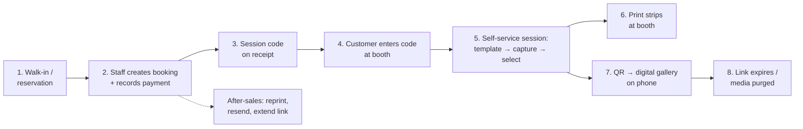

# PhotoMob — Product Requirements

> Self photo booth for a physical store: customers run their own session on a touch screen with a real DSLR, walk away with printed strips, and scan a QR to get their photos on their phone — with links that expire.

---

## 1. Vision & Goals

**Vision**: A production-ready, template-driven self photo booth that one store can operate daily — and that can grow (more templates, online booking, more stores) without rework.

**Goals**
1. **End to end**: booking → payment → booth session → print → digital delivery → after-sales, all in one system.
2. **Template as data**: frames/styles are content managed by admin, not code. New look = upload assets, not redeploy.
3. **DSLR made easy**: camera integration behind a clean interface; booth still works with a webcam if the DSLR fails or is absent.
4. **Right-sized**: production quality (auth, state machines, retention, offline tolerance) without enterprise ceremony.

**Non-goals for v1** (deferred, see §6)
- Online self-booking + payment gateway
- Boomerang/GIF/video capture
- Multi-store management UI (data model supports it; UI later)
- Visual drag-and-drop template designer (v1 uses JSON config + asset upload)
- AI features (background removal, beauty filters)

---

## 2. Personas

| Persona | Who | Cares about |
|---|---|---|
| **Customer** | Walk-in guest, usually a small group, phone in hand | Fun, fast, looks great, easy to get the photos on their phone |
| **Staff** | Counter operator | Create booking fast, take payment, hand customer a session code, fix problems (reprint, resend link) |
| **Admin/Owner** | Store owner (Toku 😄) | Revenue overview, packages/pricing, templates, media retention, device health |

---

## 3. The End-to-End Journey

---

## 4. Flows

### F1 — Booking & Payment (staff, walk-in first)

1. Staff opens **New Booking** in the web app: customer name + phone, package, party size, now-or-scheduled time.
2. Staff records payment: amount auto-filled from package, method = cash / QRIS / transfer (payment happens outside the system in v1; we **record** it).
3. On payment complete → booking is **CONFIRMED** and a **session code** (short, keypad-friendly) is issued — printed on the receipt or just told to the customer.
4. Scheduled bookings: same flow, session code activates only within its time window.

Rules:
- A session code is single-use and bound to one booth session.
- Booking without completed payment cannot check in (staff can override with a reason — logged).

### F2 — Booth Session (customer, self-service)

The heart of the product. Screen-by-screen:

| # | Screen | What happens |
|---|---|---|
| 1 | **Attract** | Looping animation, sample strips, "Touch to start" |
| 2 | **Code entry** | Big keypad, customer enters session code → API validates → session ACTIVE, timer starts (package duration, e.g. 10 min, always visible) |
| 3 | **Template pick** | Categories allowed by package (Strip 2×6 / 4R 4×6 / Polaroid). Big previews. Templates are cached locally — works offline |
| 4 | **Get ready** | Full-screen live view, framing guide, "Find your pose!" |
| 5 | **Capture** | Fixed shot count from package (e.g. **8 shots**). Each: 5-4-3-2-1 countdown → DSLR fires → 2s preview → auto-advance. Shutter sound + flash animation |
| 6 | **Select** | All shots in a film-strip; customer taps shots into the template's slots (e.g. best 4 of 8). **Retake** available per slot while time remains |
| 7 | **Style** | Frame color variants defined by the template (e.g. cream / sage / sky). Keep it light in v1 — variants only, no free-form editor |
| 8 | **Confirm & print** | Final preview → "Print!" → composing (~2s) → printing progress with a fun animation |
| 9 | **QR / delivery** | Big QR + short URL + PIN: "Scan to get all your photos!" Digital gallery includes the composed strip **and** all raw shots |
| 10 | **Thank you** | Confetti 🎉 → back to Attract |

Rules & resilience:
- Session timer expiry mid-flow → gentle "time's up" → jumps to Select with whatever was captured (customer never loses photos).
- Camera failure mid-session → automatic fallback to webcam + discreet staff alert; the session continues.
- Print failure → QR screen still shows (digital delivery never blocked by the printer); staff alerted for reprint.
- Abandoned session (idle > 3 min) → auto-close, media still uploaded, staff can recover.

### F3 — Digital Delivery & Gallery

1. During/after the session, the booth uploads raw shots + composed outputs to the API (background queue, retries — survives bad Wi-Fi).
2. API issues a **delivery link**: `go.<domain>/g/<shortCode>` + 4-digit PIN (printed with the QR).
3. Customer opens the gallery on their phone: composed strip first, then all raws; per-photo and download-all.
4. **Expiration**: link expires after N days (default 7, per-package configurable). Expired link shows a friendly "expired — ask the store" page.
5. **Retention**: media files are hard-deleted after M days (default 30). Purge is automated and logged.

### F4 — After-Sales (staff/admin)

- **Find session** by code, customer name, phone, or date.
- **Reprint** a composed output (queued to the booth printer or any store printer).
- **Resend / extend** delivery link (new expiry, optionally new code).
- **Recover** an abandoned session — issue a delivery link manually.
- Admin **dashboard**: sessions today, revenue (from recorded payments), popular templates, device health (booth online? camera OK? printer OK? disk space?).

### F5 — Template Management (admin)

- Template = **config (JSON) + assets (PNG)**: canvas size, slot rectangles, frame overlay with transparent windows, optional background, color variants, print settings. Full schema in [ARCHITECTURE.md §8](ARCHITECTURE.md).
- Admin uploads assets + config, previews the rendered result with sample photos, then **activates**. Versioned: a session references the exact template version it used.
- Booth syncs active templates on start + periodically; caches assets locally.

---

## 5. Milestones — "Success Feeling First"

Each milestone ends with something that **works end to end** and feels good to demo.

| Milestone | Slice | The demo moment |
|---|---|---|
| **M0 — Walking skeleton** | Monorepo, booth (webcam), 1 hardcoded template, compose, upload, gallery link | *Take a photo at the booth, scan the QR, see your strip on your phone.* The magic works. |
| **M1 — Real booth** | digiCamControl DSLR + live view, template sync from API, full capture→select→style flow, hot-folder printing | *A stranger completes a session alone and holds a printed strip.* |
| **M2 — Store operations** | Staff/admin auth, bookings, packages, payment recording, session codes, code-gated booth | *Staff sells a session; the receipt code starts the booth.* |
| **M3 — Delivery & after-sales** | Expiring links + PIN, retention purge job, find/resend/extend/reprint, dashboard | *A customer comes back day 6: staff extends their link in 10 seconds.* |
| **M4 — Hardening** | Offline queue polish, device heartbeat + health alerts, kiosk lockdown, crash recovery, backups | *Unplug the network mid-session; nothing is lost.* |
| **Later** | Online booking + payment gateway (Midtrans/Xendit), GIF/boomerang, multi-store UI, visual template designer, AI extras | — |

---

## 6. Theme & Design Direction — "Clean, but Fun"

Explicitly **not** boothlev's neo-brutalism.

- **Base is clean**: generous white space, soft off-white surfaces, near-black ink text, rounded-2xl geometry, soft shadows, calm grids.
- **Fun lives in the accents**: one saturated accent color (e.g. coral/tangerine family), pastel secondary set that echoes template variants, springy micro-animations, a confetti moment when the print starts, friendly copy ("Find your pose!" not "Step 4 of 9").
- **Type**: a warm rounded sans (e.g. Plus Jakarta Sans) for everything; one expressive display face reserved for big booth moments.
- **Booth-specific**: huge touch targets (≥ 64px), readable from 1.5m, minimal text per screen, always-visible session timer, ID/EN copy.
- **Admin**: same system, quieter — density and clarity over playfulness.

---

## 7. Success Metrics

- Session completion rate (started → printed) ≥ 95%
- Time from code entry to print ≤ package duration for ≥ 90% of sessions
- Gallery link open rate ≥ 80% of completed sessions
- Zero lost-media incidents (captured but never delivered)
- Staff can execute any after-sales action in under 1 minute

---

## 8. Open Questions

Confirmed decisions live in [DECISIONS.md](DECISIONS.md). Still open — needed before/during M1–M2:

1. **Camera brand/model?** digiCamControl favors Canon/Nikon. Determines live-view quality settings and cable/tether setup.
2. **Printer model?** DNP (e.g. DS-RX1HS) vs HiTi — decides hot-folder utility vs driver printing details.
3. **Shot count & session duration per package?** (assumed 8 shots / 10 min for the base package)
4. **Receipt printing?** Does the counter have a receipt printer for the session code + QR, or is the code shown/told only?
5. **Branding**: final name ("PhotoMob"?), domain, accent color.
6. **Gallery PIN** — require always, or only when staff enables it per booking?
