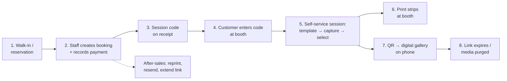

# PhotoMob — Product Requirements

> Self photo booth for a physical store: customers run their own session on a touch screen with a real DSLR, walk away with printed strips, and scan a QR to get their photos on their phone — with links that expire.

---

## 1. Vision & Goals

**Vision**: A production-ready, template-driven self photo booth that one store can operate daily — and that can grow (more templates, online booking, more stores) without rework. PhotoMob is a **whitelabel base**: one codebase that ships either as a single-brand install for a client or as a multi-brand SaaS ([ADR-012](DECISIONS.md)).

**Goals**
1. **End to end**: booking → payment → booth session → print → digital delivery → after-sales, all in one system.
2. **Template as data**: frames/styles are content managed by admin, not code. New look = upload assets, not redeploy.
3. **DSLR made easy**: camera integration behind a clean interface, **brand-agnostic** (Canon/Nikon/Sony via the same adapter); booth still works with a webcam if the DSLR fails or is absent.
4. **Right-sized**: production quality (auth, state machines, retention, offline tolerance) without enterprise ceremony.
5. **Whitelabel-ready**: brand (name, logo, colors, fonts, copy, domain) is data, not code — §6 is the *default* theme, not the only one.

**Non-goals for v1** (deferred, see §6)
- Online self-booking + payment gateway
- Boomerang/GIF/video capture
- Multi-store management UI (data model supports it; UI later)
- Visual drag-and-drop template designer (v1 uses JSON config + asset upload)
- AI features (background removal, beauty filters)
- SaaS product machinery (tenant self-signup, billing, plan limits) — the data model is tenant-ready from day one ([ADR-012](DECISIONS.md)); the product features come when there's a second client

---

## 2. Personas

| Persona | Who | Cares about |
|---|---|---|
| **Customer** | Walk-in guest, usually a small group, phone in hand | Fun, fast, looks great, easy to get the photos on their phone |
| **Staff** | Counter operator | Create booking fast, take payment, hand customer a session code, fix problems (reprint, resend link) |
| **Admin/Owner** | Store owner (Toku 😄) | Revenue overview, packages/pricing, templates, media retention, device health |
| **Box Operator** | Bought a Potoku Box, runs it at their venue/event ([ADR-018](DECISIONS.md)) | Box sells sessions by itself, earnings visible from their phone, paper roll is the only maintenance |
| **Platform (Toku)** | Operates the SaaS + Midtrans merchant account ([ADR-019](DECISIONS.md), [ADR-021](DECISIONS.md)) | Subscriptions collected, payouts correct, fleet healthy, onboarding friction near zero |

---

## 3. The End-to-End Journey

---

## 4. Flows

### F1 — Booking & Payment (staff, walk-in first)

1. Staff opens **New Booking** in the web app: customer name + phone, package, party size, now-or-scheduled time.
2. Staff records payment: amount auto-filled from package, method = cash / QRIS / transfer (payment happens outside the system in v1; we **record** it).
3. On payment complete → booking is **CONFIRMED** and a **session code** (short, keypad-friendly) is issued — printed big on an **80mm thermal receipt** (brand header, package, amount, method, session code). v1 prints the receipt from the staff browser via print-CSS + silent kiosk printing; the ESC/POS path is a known upgrade ([ADR-013](DECISIONS.md)). The gallery QR + PIN are *not* on the receipt — they're issued at the booth (F2 screen 9) and resendable by staff (F4).
4. Scheduled bookings: same flow, session code activates only within its time window.

Rules:
- A session code is single-use and bound to one booth session.
- Booking without completed payment cannot check in (staff can override with a reason — logged).

### F2 — Booth Session (customer, self-service)

The heart of the product. Screen-by-screen:

| # | Screen | What happens |
|---|---|---|
| 1 | **Attract** | Looping animation, sample strips, "Touch to start" |
| 2 | **Code entry** | Big keypad, customer enters session code → API validates → session ACTIVE, timer starts (package duration, e.g. 10 min, always visible) |
| 3 | **Template pick** | Categories allowed by package (Strip 2×6 / 4R 4×6 / Polaroid). Big previews. Templates are cached locally — works offline |
| 4 | **Get ready** | Full-screen live view, framing guide, "Find your pose!" |
| 5 | **Capture** | **Shooting window** from the package (e.g. 3 min), not a fixed count ([ADR-014](DECISIONS.md)). Loop: 5-4-3-2-1 countdown → DSLR fires → 2s preview → next, until the window ends or the customer taps **"I'm done"**. Hard shot cap (e.g. 30) keeps storage/upload bounded. Shutter sound + flash animation |
| 6 | **Select** | All shots in a film-strip; customer picks **exactly as many as the template has slots** (polaroid/4R = 1, strip = 4). Unpicked shots still reach the digital gallery. **"Shoot more"** returns to Capture while window time remains |
| 7 | **Style** | Frame color variants defined by the template (e.g. cream / sage / sky). Keep it light in v1 — variants only, no free-form editor |
| 8 | **Confirm & print** | Final preview → "Print!" → composing (~2s) → printing progress with a fun animation |
| 9 | **QR / delivery** | Big QR + short URL + PIN: "Scan to get all your photos!" Digital gallery includes the composed strip **and** all raw shots |
| 10 | **Thank you** | Confetti 🎉 → back to Attract |

Rules & resilience:
- Session timer expiry mid-flow → gentle "time's up" → jumps to Select with whatever was captured (customer never loses photos).
- Camera failure mid-session → automatic fallback to webcam + discreet staff alert; the session continues.
- Print failure → QR screen still shows (digital delivery never blocked by the printer); staff alerted for reprint.
- Abandoned session (idle > 3 min) → auto-close, media still uploaded, staff can recover.

### F3 — Digital Delivery & Gallery

1. During/after the session, the booth uploads raw shots + composed outputs to the API (background queue, retries — survives bad Wi-Fi).
2. API issues a **delivery link**: `go.<domain>/g/<shortCode>` + 4-digit PIN (printed with the QR).
3. Customer opens the gallery on their phone: composed strip first, then all raws; per-photo and download-all.
4. **Expiration**: link expires after N days (default 7, per-package configurable). Expired link shows a friendly "expired — ask the store" page.
5. **Retention**: media files are hard-deleted after M days (default 30). Purge is automated and logged.

### F4 — After-Sales (staff/admin)

- **Find session** by code, customer name, phone, or date.
- **Reprint** a composed output (queued to the booth printer or any store printer).
- **Resend / extend** delivery link (new expiry, optionally new code).
- **Recover** an abandoned session — issue a delivery link manually.
- Admin **dashboard**: sessions today, revenue (from recorded payments), popular templates, device health (booth online? camera OK? printer OK? disk space?).

### F5 — Template Management (admin)

- Template = **config (JSON) + assets (PNG)**: canvas size, slot rectangles, frame overlay with transparent windows, optional background, color variants, print settings. Full schema in [ARCHITECTURE.md §8](ARCHITECTURE.md).
- Admin uploads assets + config, previews the rendered result with sample photos, then **activates**. Versioned: a session references the exact template version it used.
- Booth syncs active templates on start + periodically; caches assets locally.

### F6 — Booth Setup & Settings (staff, on-device) — [ADR-015](DECISIONS.md)

- Hidden gesture (e.g. 5 taps in a corner) + staff passcode opens **Settings**; locked while a session is active.
- **Camera picker**: one unified list — DSLRs found by digiCamControl + every plugged webcam — choose primary *and* fallback. Live preview while choosing.
- **Printer picker**: hot-folder mode (pick folder — DNP) or driver mode (pick from installed Windows printers — HiTi and others).
- **Test buttons**: Test capture, Test print, and a full **hardware check** (capture → compose → sample print) with a pass/fail report — self-service hardware certification.
- Config persists locally (survives restarts, works offline); export/import for provisioning the next booth; admin dashboard shows each booth's hardware via heartbeat.

### F7 — Box Self-Service Session (customer, pay-to-start) — [ADR-018/019/020](DECISIONS.md)

The Potoku Box flow: F2 with payment replacing the session code, on a device in `self-service` mode. Screen-by-screen (unchanged F2 screens compressed):

| # | Screen | What happens |
|---|---|---|
| 1 | **Attract** | Looping animation, sample strips, **price on screen**, "Touch to start" |
| 2 | **Package & pay** | Package pick (or single price) → big **dynamic QRIS** + amount + countdown (~15 min charge expiry). Box polls the API for payment status — never Midtrans directly |
| 3 | **Paid!** | Celebratory confirmation the moment the webhook lands → session ACTIVE, timer starts. No session code — the paying box *is* the booth |
| 4–7 | **Template → Capture → Select → Style** | Exactly F2 screens 3–7 (webcam camera) |
| 8 | **Print** | Thermal strip: dithered mono photo stack + brand header + gallery QR/PIN ([ADR-020](DECISIONS.md)). Full-color composed strip still uploads to the gallery unchanged |
| 9–10 | **QR / Thank you** | F2 screens 9–10. Print failure never blocks the QR screen |

Rules & resilience:
- **Money before session**: no payment → no session, ever. Webhook is the only trusted "paid" signal; box polling is read-only.
- **Paid but box died** (crash/power mid-session): on restart the box finds the paid-unconsumed booking and offers "Continue your session"; unrecoverable → flagged for refund in the operator dashboard, customer sees an apology screen with the operator's contact.
- **QR expired / customer walked away**: charge expires server-side, attract resumes; the booking row persists as Expired (audit trail) — no session, no media, nothing customer-visible.
- **Offline box**: self-service mode requires connectivity to sell (payment is online by nature) → "Be right back" screen + operator alert; an in-flight paid session continues on the offline queues (media uploads when back).
- **Subscription lapsed** ([ADR-021](DECISIONS.md)): box goes "not in service" from the attract screen only — never mid-session.

---

## 5. Milestones — "Success Feeling First"

Each milestone ends with something that **works end to end** and feels good to demo.

| Milestone | Slice | The demo moment |
|---|---|---|
| **M0 — Walking skeleton** | Monorepo, booth (webcam), 1 hardcoded template, compose, upload, gallery link | *Take a photo at the booth, scan the QR, see your strip on your phone.* The magic works. |
| **M1 — Real booth** | digiCamControl DSLR + live view, template sync from API, full capture→select→style flow, printing (hot-folder + driver), settings screen with camera/printer pickers + hardware check (F6) | *A stranger completes a session alone and holds a printed strip — on hardware staff picked themselves.* |
| **M2 — Store operations** | Staff/admin auth, bookings, packages, payment recording, session codes, code-gated booth | *Staff sells a session; the receipt code starts the booth.* |
| **M3 — Delivery & after-sales** | Expiring links + PIN, retention purge job, find/resend/extend/reprint, dashboard | *A customer comes back day 6: staff extends their link in 10 seconds.* |
| **M4 — Hardening** | Offline queue polish, device heartbeat + health alerts, kiosk lockdown, crash recovery, backups | *Unplug the network mid-session; nothing is lost.* |
| **M5 — Online booking** | Public self-booking + payment gateway (Midtrans/Xendit), webhooks, status page carrying the session code | *A customer books and pays from their phone; the code on their status page starts the booth.* |
| **M6 — Media at scale** | S3-compatible storage + migration tool, GIF/boomerang capture → gallery | *The gallery plays a boomerang; media lives in object storage.* |
| **M7 — Multi-store** | Store switcher, cross-store dashboard, store management | *One login runs five stores.* |
| **M8 — Template designer** | Visual designer emitting the same template config (no API/booth changes) | *A new template designed by dragging boxes — the JSON tab never opened.* |
| **M9 — Box walking skeleton** | Self-service mode in the booth app (ADR-018), in-box dynamic QRIS + webhook + earnings ledger (ADR-019), thermal strip printing (ADR-020) | *A stranger pays with their phone and walks away with a printed strip — no staff anywhere.* |
| **M10 — Sell the box (SaaS)** | Tenant self-signup, subscription plans + enforcement, operator earnings dashboard + settlement export, platform-admin fleet surface (ADR-021) | *A new operator signs up, pairs their box with an 8-char code, and sells their first session the same day.* |
| **M11 — Box field-hardening** | Payment edge cases (paid-but-crashed recovery, refund flagging), box kiosk profile + watchdog, thermal printer certification matrix, box BOM + provisioning runbook | *Pull the box's network cable — it politely closes; plug it back — it sells again, and the operator saw the outage from their phone.* |
| **Later** | Photo-printer upgrade tier for the Box (dye-sub, ADR-020), Android/PWA box shell (ADR-018 evolution), Midtrans recurring subscriptions + Iris auto-payout (ADR-019/021), AI extras, EDSDK adapter (needs its own ADR), notification channels (WA/email) | — |

---

## 6. Theme & Design Direction — "Clean, but Fun"

This is the **default theme of the whitelabel base** — every token below (accent, pastels, type, copy voice) lives in brand config ([ADR-012](DECISIONS.md)), not in code. Explicitly **not** boothlev's neo-brutalism.

- **Base is clean**: generous white space, soft off-white surfaces, near-black ink text, rounded-2xl geometry, soft shadows, calm grids.
- **Fun lives in the accents**: one saturated accent color (e.g. coral/tangerine family), pastel secondary set that echoes template variants, springy micro-animations, a confetti moment when the print starts, friendly copy ("Find your pose!" not "Step 4 of 9").
- **Type**: a warm rounded sans (e.g. Plus Jakarta Sans) for everything; one expressive display face reserved for big booth moments.
- **Booth-specific**: huge touch targets (≥ 64px), readable from 1.5m, minimal text per screen, always-visible session timer, ID/EN copy.
- **Admin** *(redirected 2026-07-15, WEB-104)*: the admin/SaaS workspace is a **modern, clean admin panel** — neutral slate palette, one restrained accent, sidebar navigation, dense readable tables — styled as the *Potoku product*, not the tenant's booth brand. "Clean, but fun" (pastels, confetti, display type) is customer-facing only: booth, gallery, public booking. Tenant branding appears inside admin content only where it previews customer-facing output.

---

## 7. Success Metrics

- Session completion rate (started → printed) ≥ 95%
- Time from code entry to print ≤ package duration for ≥ 90% of sessions
- Gallery link open rate ≥ 80% of completed sessions
- Zero lost-media incidents (captured but never delivered)
- Staff can execute any after-sales action in under 1 minute

**Box / self-service (Phase 2, F7)** — these decide whether the thermal-strip bet (ADR-020) is working:

- QR-shown → paid conversion ≥ 40% (a shown QR is intent; below this the price or pitch is wrong)
- Paid → strip-in-hand ≥ 97% (payment collected but no print is a refund risk, tracked via `RefundFlagged`)
- `abandoned_paid` rate ≤ 5% of paid sessions (paid customers walking away mid-flow signals UX friction)
- Refund-flag rate ≤ 1% of paid sessions; every flag acknowledged by the operator within 48h
- Operator signup → first paid session ≤ 1 day (the M10 demo promise, measured continuously)
- Box gallery link open rate tracked separately from staffed booths (the strip's QR is the main delivery path)

---

## 8. Open Questions

Confirmed decisions live in [DECISIONS.md](DECISIONS.md). Resolved 2026-07-11: camera is brand-agnostic (ADR-002 update), capture is duration-based (ADR-014), receipt printing confirmed (ADR-013), branding is whitelabel config (ADR-012), PIN is store config default-ON (ADR-010 update).

Still open — needed before/during M1–M2:

1. **First printer unit to certify?** Both brands are supported by design (ADR-006 update: DNP → hot folder, HiTi → driver/spooler) — the open item is which physical unit to buy for M1 certification.
2. **First certified camera body?** Design is brand-agnostic, but M1 validation needs one physical DSLR to certify (and start the supported-hardware matrix).
3. **Receipt printer hardware?** Any 80mm ESC/POS unit works (Epson TM-T82 class ~Rp 950rb–2.4jt, Xprinter class ~Rp 650rb); pure purchasing choice, architecture is indifferent.
4. **Package config values**: shooting-window length, shot cap, session duration per package — config values to tune in M2, not design blockers.
